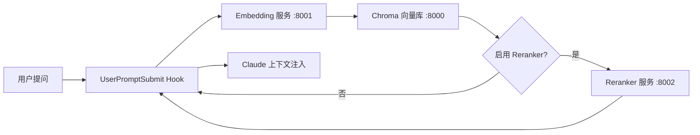

# Claude Code 知识库系统

基于 RAG 的 Claude Code 知识库系统，通过 Hook 集成实现对话增强。系统会自动检索知识库中与用户问题相关的内容，注入到 Claude 上下文中作为参考。

## 系统架构



| 组件 | 技术选型 | 说明 |
|------|----------|------|
| Embedding 模型 | BAAI/bge-large-zh-v1.5 | 中文友好，本地运行，无需 API Key |
| 向量数据库 | Chroma（v2 API） | 轻量，零配置，Docker 部署 |
| Reranker 模型 | BAAI/bge-reranker-v2-m3 | 多语言重排模型，提升检索精度（可选） |
| 集成方式 | Claude Code Hook | UserPromptSubmit 事件自动触发检索 |

## TL;DR 快速开始

```bash
# 1. 克隆项目
git clone <repo-url> rag && cd rag

# 2. 配置环境变量（默认值可直接使用）
cp .env.example .env

# 3. 启动服务（首次需下载模型，约 3-5 分钟）
docker compose up -d

# 4. 安装本地依赖
uv sync

# 5. 配置 Hook
cp scripts/search.sh .claude/hooks/

# 6. 导入知识库
uv run python scripts/import_docs.py
```

> 详细步骤见下方 [部署步骤](#部署步骤)

## 前置条件

| 依赖 | 要求 | 验证命令 |
|------|------|----------|
| Docker | 已安装并运行 | `docker --version` && `docker compose version` |
| uv | 已安装 | `uv --version` |
| Claude Code | CLI 可用 | `claude --version` |
| 磁盘空间 | ~5GB（模型 + 向量库） | `df -h` |
| jq | JSON 处理（检索脚本依赖） | `jq --version` |

## 部署步骤

### 第 1 步：获取项目

```bash
cd /path/to/your/workspace
git clone <repo-url> rag
cd rag
```

### 第 2 步：配置环境变量

```bash
cp .env.example .env
```

按需编辑 `.env`，默认值可直接使用：

| 变量 | 默认值 | 说明 |
|------|--------|------|
| `EMBEDDING_PORT` | `8001` | Embedding 服务端口 |
| `EMBEDDING_MODEL` | `BAAI/bge-large-zh-v1.5` | Embedding 模型 |
| `CHROMA_PORT` | `8000` | Chroma 端口 |
| `RERANKER_PORT` | `8002` | Reranker 服务端口 |
| `RERANK_MODEL` | `BAAI/bge-reranker-v2-m3` | Reranker 模型 |

> 大多数情况下无需修改，直接使用默认值即可。

### 第 3 步：启动 Docker 服务

```bash
# 构建并启动（首次会下载模型，约 1.2GB，需要几分钟）
docker compose up -d

# 查看启动进度（关注 embedding 服务的模型下载日志）
docker compose logs -f embedding
```

等待看到类似日志表示启动完成：

```
embedding-1  | INFO:     Model loaded successfully, dimension: 1024
embedding-1  | INFO:     Uvicorn running on http://0.0.0.0:8001
```

### 第 4 步：验证服务健康

```bash
# 检查 Embedding 服务
curl http://localhost:8001/health
# 预期输出: {"status":"healthy","model":"BAAI/bge-large-zh-v1.5","dimension":1024}

# 检查 Chroma 服务
curl http://localhost:8000/api/v2/heartbeat
# 预期输出: {"heartbeat":true}

# 检查 Reranker 服务（可选，仅在启用时检查）
curl http://localhost:8002/health
# 预期输出: {"status":"healthy","model":"BAAI/bge-reranker-v2-m3"}
```

如果 Embedding/Reranker 返回 503（Model not loaded），说明模型仍在下载，继续等待。

### 第 5 步：安装本地依赖

```bash
uv sync
```

本项目本地仅依赖 `requests`，用于 Hook 脚本调用 Docker 服务的 HTTP API。

### 第 6 步：配置 Claude Code Hook

将脚本复制到 Hook 目录：

```bash
cp scripts/search.sh .claude/hooks/
cp scripts/import_docs.py .claude/hooks/
```

确认 `.claude/settings.json` 存在且配置正确。如果文件不存在，创建如下内容：

```json
{
  "hooks": {
    "UserPromptSubmit": [{
      "hooks": [{
        "type": "command",
        "command": "bash \"$CLAUDE_PROJECT_DIR/.claude/hooks/search.sh\"",
        "timeout": 60
      }]
    }]
  },
  "env": {
    "EMBEDDING_URL": "http://localhost:8001",
    "CHROMA_URL": "http://localhost:8000",
    "RAG_TOP_K": "3",
    "RAG_MAX_CONTENT_LENGTH": "500",
    "RERANK_ENABLED": "true",
    "RERANK_CANDIDATES": "20",
    "RERANKER_URL": "http://localhost:8002",
    "RAG_DISTANCE_THRESHOLD": "1.0",
    "RERANK_SCORE_THRESHOLD": "0.3"
  }
}
```

**工作原理**：每次你在 Claude Code 中提交问题时，`search.sh` 会自动执行，将问题向量化后从 Chroma 检索相关内容，注入到对话上下文中。

> 无需手动修改此配置。如果 Embedding/Chroma 服务端口有变动，修改对应 URL 即可。

### 第 7 步：导入知识文档

将文档放入 `knowledge/` 目录，支持的格式：`.md`、`.txt`、`.py`、`.json`、`.yaml`、`.yml`。

> **示例文档**：项目已预置几个示例文档供测试：
> - `rag-guide.md` - RAG 系统使用指南
> - `xieningjun_profile.md` - 用户档案示例
> - `futengyan_profile.md`、`huangjun_profile.md` 等

```bash
uv run python scripts/import_docs.py
```

预期输出：

```
============================================================
知识库文档导入工具
============================================================
✓ Embedding 服务正常: http://localhost:8001
✓ Chroma 服务正常: http://localhost:8000
✓ Collection 已存在: knowledge (id: xxxxxxxx)

📄 knowledge/rag-guide.md
  向量化 N 个文本块...
  ✓ 导入 N 个文本块

============================================================
📊 导入完成: 1 个文件, N 个文本块
```

也可以指定自定义目录：

```bash
uv run python scripts/import_docs.py /path/to/your/docs
```

### 第 8 步：验证检索功能

在 Claude Code 中提问，观察是否出现知识库检索提示。例如：

```
> RAG 知识库怎么部署？
```

如果 Hook 生效，会看到类似提示：`📚 知识库检索完成，找到 N 条相关结果`。

也可以手动测试检索脚本：

```bash
echo '{"prompt": "部署步骤是什么"}' | bash scripts/search.sh
```

### 部署验证清单

完成以上步骤后，按此清单逐项验证：

| 检查项 | 命令 | 预期结果 |
|--------|------|----------|
| Docker 服务运行 | `docker compose ps` | 3 个服务（embedding、chroma、reranker）状态为 `running` |
| Embedding 健康 | `curl localhost:8001/health` | `{"status":"healthy",...}` |
| Chroma 健康 | `curl localhost:8000/api/v2/heartbeat` | `{"heartbeat":true}` |
| 知识库有数据 | `curl localhost:8000/api/v2/tenants/default_tenant/databases/default_database/collections` | 返回包含 `knowledge` 的 collection |
| Hook 配置存在 | `cat .claude/settings.json` | 返回有效 JSON 配置 |
| Hook 脚本存在 | `ls .claude/hooks/search.sh` | 文件存在 |
| 检索脚本可用 | `echo '{"prompt":"test"}' \| bash .claude/hooks/search.sh` | 返回 JSON 或无报错 |

**全部通过后，重启 Claude Code 会话使 Hook 生效。**

## 目录结构

```
.
├── .claude/
│   ├── settings.json           # Hook 配置 + 环境变量（需确认存在）
│   └── hooks/                  # 实际运行的 Hook 脚本（从 scripts/ 复制）
│       ├── search.sh           # 检索 Hook（UserPromptSubmit）
│       └── import_docs.py      # 文档导入脚本
├── scripts/                    # 脚本源码（编辑此目录，复制到 .claude/hooks/ 生效）
│   ├── search.sh
│   └── import_docs.py
├── data/
│   └── chroma/                 # 向量数据库持久化（Docker 挂载）
├── docker-compose.yml          # Docker 服务编排
├── embedding/                  # Embedding 服务
│   ├── Dockerfile
│   ├── pyproject.toml
│   └── app/
│       └── main.py             # FastAPI 向量化服务
├── knowledge/                  # 待导入的知识文档（已含示例）
├── reranker/                   # Reranker 服务（可选，用于重排）
└── pyproject.toml              # 本地依赖
```

## 配置参考

### 检索参数（.claude/settings.json → env）

| 变量 | 默认值 | 说明 |
|------|--------|------|
| `EMBEDDING_URL` | `http://localhost:8001` | Embedding 服务地址 |
| `CHROMA_URL` | `http://localhost:8000` | Chroma 服务地址 |
| `RAG_TOP_K` | `3` | 每次检索返回的最大条数 |
| `RAG_MAX_CONTENT_LENGTH` | `500` | 每条检索结果的最大字符数 |
| `RAG_DISTANCE_THRESHOLD` | `1.0` | 距离阈值（仅纯向量模式生效），超过此值的结果会被过滤 |
| `RERANK_ENABLED` | `false` | 是否启用重排（需启动 reranker 服务） |
| `RERANKER_URL` | `http://localhost:8002` | Reranker 服务地址 |
| `RERANK_CANDIDATES` | `20` | 启用重排时的候选数量 |
| `RERANK_SCORE_THRESHOLD` | `0.3` | 重排相关性阈值，score 低于此值的结果会被过滤 |

### 文档导入参数（import_docs.py 内置）

| 参数 | 默认值 | 说明 |
|------|--------|------|
| `CHUNK_SIZE` | `500` | 文本分块大小（字符数） |
| `CHUNK_OVERLAP` | `50` | 分块重叠大小 |

## 扩展点：Reranker 重排

默认关闭。启用后会在向量检索之后、返回结果之前增加一轮精排，提升检索精度。

### 过滤逻辑

| 模式 | 过滤条件 | 说明 |
|------|----------|------|
| 纯向量检索（RERANK_ENABLED=false） | `distance < RAG_DISTANCE_THRESHOLD` | 按向量距离过滤 |
| Reranker 重排（RERANK_ENABLED=true） | `score >= RERANK_SCORE_THRESHOLD` | 按相关性分数过滤 |

> **设计说明**：Reranker 模式下仅使用 score 过滤，不再过滤 distance。因为 Reranker 的交叉编码比向量距离更能准确反映语义相关性，应信任 Reranker 的判断。

### 检索流程对比

```
纯向量模式：
  问题 → Embedding → Chroma 检索(取3条) → 过滤 distance → 返回

Reranker 模式：
  问题 → Embedding → Chroma 检索(取20条) → Reranker 精排 → 过滤 score → 返回 Top 3
```

### 启用方式

1. 启动 Reranker 服务：

```bash
docker compose up -d reranker
```

2. 修改 `.claude/settings.json`，在 `env` 中设置：

```json
{
  "env": {
    "RERANK_ENABLED": "true",
    "RERANKER_URL": "http://localhost:8002",
    "RERANK_CANDIDATES": "20",
    "RERANK_SCORE_THRESHOLD": "0.3"
  }
}
```

3. 重启 Claude Code 会话使配置生效。

### 关闭方式

1. 将 `RERANK_ENABLED` 设为 `false`
2. 停止服务（可选）：

```bash
docker compose stop reranker
```

## 常用命令

```bash
# 启动服务（全部）
docker compose up -d

# 仅启动核心服务（不含 Reranker）
docker compose up -d embedding chroma

# 查看服务状态
docker compose ps

# 查看 Embedding 服务日志
docker compose logs -f embedding

# 查看 Chroma 服务日志
docker compose logs -f chroma

# 查看 Reranker 服务日志
docker compose logs -f reranker

# 停止服务
docker compose down

# 导入文档到知识库
uv run python scripts/import_docs.py

# 手动测试检索
echo '{"prompt": "你的问题"}' | bash scripts/search.sh
```

## 常见问题

### Embedding / Reranker 服务启动很慢

首次启动需要下载模型，取决于网络速度，通常需要 3-10 分钟：
- Embedding 模型（bge-large-zh-v1.5）：约 1.2GB
- Reranker 模型（bge-reranker-v2-m3）：约 2.3GB

可通过 `docker compose logs -f embedding` 或 `docker compose logs -f reranker` 查看下载进度。

如果下载缓慢，可配置 HuggingFace 镜像源。在 `.env` 中设置：

```bash
HF_CACHE_DIR=~/.cache/huggingface
```

并参考 [HuggingFace 镜像配置](https://huggingface.co/docs/hub/mirror) 设置环境变量。

### 端口被占用

如果 8000、8001 或 8002 端口已被占用，修改 `.env` 中的 `CHROMA_PORT` / `EMBEDDING_PORT` / `RERANKER_PORT`，并同步修改 `.claude/settings.json` 中对应的 `CHROMA_URL` / `EMBEDDING_URL` / `RERANKER_URL`。

### 检索不到结果

可能原因：
- 知识库为空 → 先运行 `import_docs.py` 导入文档
- 距离阈值过低 → 调大 `RAG_DISTANCE_THRESHOLD`（默认 1.2）
- Docker 服务未运行 → 执行 `docker compose up -d`

### Hook 未触发

排查步骤：

1. **确认配置文件存在**：
   ```bash
   cat .claude/settings.json
   ```
   如果不存在，参考"第 6 步"创建。

2. **确认脚本可执行**：
   ```bash
   ls -la .claude/hooks/search.sh
   chmod +x .claude/hooks/search.sh  # 如果没有执行权限
   ```

3. **手动测试脚本**：
   ```bash
   echo '{"prompt": "测试问题"}' | bash .claude/hooks/search.sh
   ```
   应返回 JSON 格式结果或无报错退出。

4. **确认在正确项目目录**：
   Hook 只在包含 `.claude/settings.json` 的项目目录下生效。确保你是在该项目根目录启动的 Claude Code。

5. **重启 Claude Code 会话**：
   修改 `settings.json` 后需要重启会话才能生效。

6. **使用 /hooks 命令检查**：
   在 Claude Code 中输入 `/hooks` 查看当前 Hook 状态。

### 知识库检索无结果

1. **确认已导入文档**：
   ```bash
   uv run python scripts/import_docs.py
   ```

2. **检查 collection 是否存在**：
   ```bash
   curl -s http://localhost:8000/api/v2/tenants/default_tenant/databases/default_database/collections | jq '.'
   ```

3. **调整距离阈值**：
   如果 `RAG_DISTANCE_THRESHOLD` 设置过低（如 0.3），可能导致结果被过滤。尝试调高到 0.5 或 1.0。

4. **检查问题与文档相关性**：
   确保你的问题与知识库中的文档内容相关。
